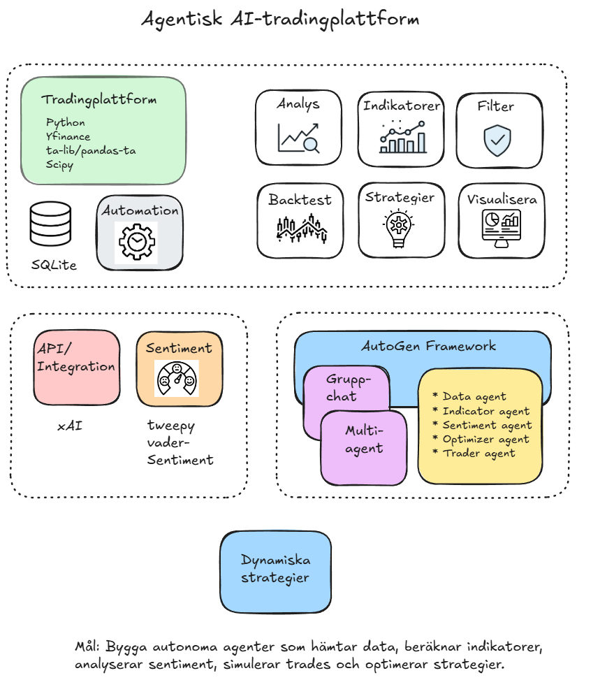

# Agentic AI Trading Platform for Commodities

*Diagram of ETL flow (core) and advanced agents (sentiment + optimization).*

## Project Overview
A Python-based trading platform for commodity futures (focus: Coffee KC=F), built as a project for Data Scientist coursework. Core focus: Robust ETL pipeline with yfinance for data, pandas for processing, SQLite for storage, and backtrader for strategy backtesting. Strategy: "Gaussian + Kijun + VAPI + ATR + SMMA 200" on 30-min timeframe.

Advanced extension (next course): Integrate AI agents via Microsoft AutoGen and xAI API for sentiment analysis and dynamic optimization (e.g., Gaussian length, ADX threshold).

Tech stack: Python 3.12, yfinance, pandas-ta, backtrader, schedule, matplotlib, pytest, AutoGen (advanced).

Deployment: Ubuntu LXC container in homelab (GMKTec G3 with Proxmox) for snapshots/backups.

Goals:
- Validate strategy via backtesting (target: >60% winrate, <10% drawdown).
- Extensible for other commodities (e.g., Brent BZ=F).
- Good code with type hints, docstrings, and modular structure.

## Project Structure
ai_trading_platform/
├── app/
│   ├── init.py
│   ├── automate.py      # Schedule ETL
│   ├── backtest.py      # Backtrader run + analyzers
│   ├── data_fetch.py    # yfinance OHLCV fetch
│   ├── database.py      # SQLite store/fetch
│   ├── indicators.py    # Gaussian, Kijun, VAPI, ADX, ATR, SMMA
│   ├── logger.py        # Centralized logging
│   ├── main.py          # ETL + backtest
│   ├── strategies.py    # Entry/exit logic
│   ├── transform.py     # Clean + indicators
│   └── visualize.py     # Plots
├── config/
│   └── config.py        # Pydantic configs (trading, DB, API)
├── data/
│   └── trading.db       # SQLite DB
├── logs/
│   └── app.log          # General log
│   ├── automate.log     # Automation log
├── results/
│   ├── plots/           # PNG charts
│   └── reports/         # CSV summaries (backtest_summary.csv, trades_detailed.csv)
├── tests/
│   ├── init.py
│   └── test_*.py        # Pytest suite
├── requirements.txt     # Dependencies
└── README.md            # This file

## Quick Start 
The ETL flow is a linear pipeline for fetching, cleaning, and analyzing KC=F data on a 30-min interval:

1. **Extract**: `data_fetch.py` fetches OHLCV from yfinance (60 days, no ffill for gaps).
2. **Transform**: `transform.py` cleans (removes NaN/outliers), calculates indicators (`indicators.py`: triple EMA Gaussian, EMA VAPI, etc.).
3. **Load**: `database.py` saves to SQLite (`data/trading.db`).
4. **Backtest**: `backtest.py` runs the strategy (`strategies.py`) with analyzers, saves a summary/plot.

Run: `python populate_historical.py --days 60` (backfill), then `python -m app.main` (full run). See `results/reports/backtest_summary.csv` for metrics.

## Detailed ETL Pipeline

*Diagram of ETL flow.*

The ETL flow (see the Excalidraw image above for a visual overview) is modular for reliability:

1. **Data Fetch (`app/data_fetch.py`)**:
   - Fetches OHLCV for KC=F via yfinance (interval='30m', lookback=60 days).
   - Handles DatetimeIndex, timezone-naive, basic validation (high != low, volume >0).
   - Returns pd.DataFrame or None on error.

2. **Database Operations (`app/database.py`)**:
   - Initializes a SQLite table (`ohlcv_data` with date PK).
   - Saves with `INSERT OR IGNORE` (avoids duplicates).
   - Fetches with date filter for transformation.

3. **Data Cleaning (`app/transform.py`)**:
   - Removes NaN, outliers (5 std), sorts by Date.
   - No ffill/resample – preserves gaps for authentic backtesting.

4. **Indicator Calculation (`app/indicators.py`)**:
   - Gaussian: Triple EMA 
   - Kijun-Sen: (HHV(high,125) + LLV(low,125))/2.
   - VAPI: EMA(close*volume)/EMA(volume) (price-scaled).
   - ADX/ATR: pandas_ta.
   - SMMA: Recursive RMA.
   - Swing: Rolling max/min (55 bars, shift(1) for latest).

5. **Strategy & Backtest (`app/strategies.py` + `app/backtest.py`)**:
   - Entry: Synchronized conditions (gauss_up + vapi_up + ADX>25 + close>SMMA + close>Kijun for LONG).
   - Exit: Trendbreak (close<Kijun), TP1 (0.75R partial close), breakeven (+0.4R), trailing (ATR*3).
   - Backtrader runs with analyzers (TradeAnalyzer, DrawDown), saves metrics to CSV.

The flow is event-driven (backtrader) for futures simulation, with logging through  `app/logger.py`.

## Installation
1. **Environment**: Python 3.12 i Ubuntu LXC (Proxmox).
   - `sudo apt install python3.12 python3-pip`
2. **Dependencies**: `pip install -r requirements.txt` (yfinance, pandas, pandas_ta, backtrader, schedule, matplotlib, pytest, pydantic).
3. **Database**: Kör `python -m app.main` för init.

## Usage
- **Historical backfill**: `python populate_historical.py --days 60`
- **Full run**: `python -m app.main` (ETL + backtest)
- **Automation**: `python app/automate.py` (daglig kl. 20:00)
- **Tests**: `pytest tests/ -v`
- **Plot**: `results/plots/backtest_chart.png` (sista 3 dagar med ATR-band, trades).

For advanced extension  (project course): See `sentiment.py` and `agents.py` for X sentiment + AutoGen optimization later on.

## License
MIT License.